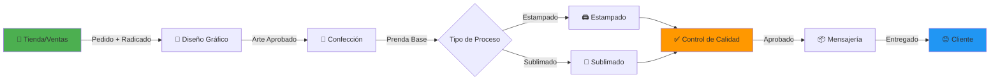

<div align="center">

# 🏭 Software Gestión Ciclo de Pedidos

### Sistema ERP/MRP para Manufactura Textil y Personalización


[](https://github.com/D3C0D1/Software-control-manufactura-logistica)
[](https://github.com/D3C0D1/Software-control-manufactura-logistica/releases)
[](LICENSE)
[](https://www.php.net/)
[](https://www.mysql.com/)
[](https://github.com/D3C0D1/Software-control-manufactura-logistica)

</div>

---

## 📋 Descripción

**Software Gestión Ciclo de Pedidos** es una solución integral tipo **ERP/MRP** diseñada específicamente para empresas de manufactura textil y personalización. Este sistema revoluciona la forma en que las empresas gestionan el ciclo de vida completo de pedidos personalizados, desde la captura inicial hasta la entrega final.

### 🎯 Problema que Resuelve

- **Para la Empresa:** Elimina el caos operativo, centraliza información en tiempo real y optimiza la coordinación entre áreas de producción, diseño, calidad y logística.
- **Para el Cliente:** Brinda transparencia total del proceso mediante un sistema de trazabilidad en tiempo real, reduciendo incertidumbre y consultas repetitivas.

### 🌟 Funcionalidad Estrella

**Sistema de Trazabilidad en Tiempo Real para Clientes:**

1. Al crear un pedido, el sistema genera un **Número de Guía (Radicado)** único.
2. El cliente recibe automáticamente este código vía **SMS**.
3. El cliente accede a la web, ingresa su código y visualiza:
   - **Área actual** donde se encuentra su pedido (ej: "Estampado")
   - **Estado preciso** del proceso (ej: "En proceso de curado")
   - **Historial de movimientos** entre áreas
   - **Estimación de entrega**

*"Convierte la ansiedad del cliente en confianza mediante visibilidad total"*

---

## 🏗️ Módulos del Sistema

El software conecta **6 áreas operativas clave** en un flujo continuo y trazable:

| Módulo | Descripción | Función Principal |
|--------|-------------|-------------------|
| 🏪 **Tienda (Ventas)** | Punto de entrada del pedido | Captura de pedidos, generación de radicados, notificación SMS |
| 🎨 **Diseño Gráfico** | Gestión creativa | Carga de artes, revisión, aprobaciones y envío a producción |
| 👕 **Confección** | Manufactura textil | Corte, costura y preparación de prendas base |
| 🖨️ **Estampado** | Producción de estampados | Aplicación de diseños mediante técnicas de estampado |
| 🌈 **Sublimado** | Producción de sublimados | Proceso de sublimación para diseños de alta calidad |
| ✅ **Control de Calidad** | Verificación y validación | Inspección de productos, detección de defectos y aprobación |
| 📦 **Mensajería (Logística)** | Gestión de envíos | Empaque, coordinación con transportadoras y despacho |

### 📌 Características Adicionales

- 📊 **Dashboard Gerencial** con métricas en tiempo real
- 👥 **Gestión de Usuarios** con roles y permisos
- 📱 **Sistema PQRS** (Peticiones, Quejas, Reclamos, Sugerencias)
- 📈 **Reportes y Auditoría** completos
- 🔔 **Sistema de Notificaciones** automáticas
- 🔐 **Autenticación y Seguridad** robusta

---

## 🔄 Arquitectura del Flujo



### 🚀 Flujo Detallado

1. **Inicio del Pedido:**
   - Cliente realiza pedido en tienda física/online
   - Sistema genera **Número de Guía** único
   - Cliente recibe SMS con código de seguimiento

2. **Fase de Diseño:**
   - Diseñadores cargan artes gráficos
   - Sistema solicita aprobación del cliente
   - Arte aprobado pasa automáticamente a producción

3. **Producción:**
   - Confección prepara la prenda base
   - Según el tipo, pasa a Estampado o Sublimado
   - Cada transición actualiza el estado en tiempo real

4. **Validación:**
   - Control de Calidad verifica el producto
   - Si hay defectos, puede retornar a producción
   - Producto aprobado continúa al siguiente paso

5. **Entrega:**
   - Mensajería empaca y coordina envío
   - Cliente puede rastrear en cada momento
   - Sistema notifica al entregar

---

## 💻 Stack Tecnológico

### Backend
```
• Lenguaje Principal:    [PHP 7.4+]
• Base de Datos:         [MySQL 8.0+]
• ORM/Query Builder:     [Native MySQLi / PDO]
• API SMS:               [Onurix SMS Integration]
```

### Frontend
```
• HTML5/CSS3:           [Responsive Design]
• JavaScript:           [Vanilla JS + jQuery]
• Framework CSS:        [Custom CSS / Bootstrap]
• Interactividad:       [AJAX / Fetch API]
```

### Infraestructura
```
• Servidor Web:         [Apache / Nginx]
• Entorno de Desarrollo: [AMPPS / XAMPP]
• Control de Versiones: [Git / GitHub]
• Composer:             [Dependency Management]
```

### Integraciones
```
• SMS Gateway:          [Onurix SMS API]
• Gestión de Archivos:  [Upload/Storage System]
• Generación de PDFs:   [FPDF / Similar]
• Logs y Auditoría:     [Custom Logging System]
```

---

## 🚀 Instalación y Uso

### Prerrequisitos

```bash
# Requisitos del sistema
- PHP >= 7.4
- MySQL >= 8.0
- Apache/Nginx
- Composer (opcional)
- Extensiones PHP: mysqli, pdo, gd, curl, mbstring
```

### Instalación

1. **Clonar el repositorio:**
```bash
git clone https://github.com/D3C0D1/Software-control-manufactura-logistica.git
cd Software-control-manufactura-logistica
```

2. **Configurar la base de datos:**
```bash
# Crear base de datos
mysql -u root -p
CREATE DATABASE glamcity_db;

# Importar estructura
mysql -u root -p glamcity_db < glamcity_db.sql
```

3. **Configurar archivo de conexión:**
```bash
# Editar php/config.php o config.php
# Actualizar credenciales de base de datos

DB_HOST=localhost
DB_USER=tu_usuario
DB_PASS=tu_contraseña
DB_NAME=glamcity_db
```

4. **Instalar dependencias (si usa Composer):**
```bash
composer install
```

5. **Configurar permisos:**
```bash
chmod 755 uploads/
chmod 755 logs/
chmod 644 php/config.php
```

### Acceso al Sistema

```
URL Base:     http://localhost/Software-control-manufactura-logistica/
Login:        /login.php
Dashboard:    /dashboard.php

Credenciales por defecto:
Usuario:      admin
Contraseña:   [Definir en instalación]
```

### Estructura de Módulos

```
📁 Áreas de Trabajo
├── 🏪 /recepcion.php          → Tienda/Ventas
├── 🎨 /diseno.php             → Diseño Gráfico
├── 👕 /confeccion.php         → Confección
├── 🖨️ /impresion.php          → Estampado
├── 🌈 /sublimado.php          → Sublimado
├── ✅ /control_calidad.php    → Control de Calidad
└── 📦 /mensajeria.php         → Mensajería/Logística

📁 Administración
├── 👥 /admin_users.php        → Gestión de Usuarios
├── ⚙️ /configuracion.php      → Configuración del Sistema
├── 📊 /reportes.php           → Reportes y Estadísticas
└── 📋 /auditoria.php          → Auditoría

📁 Cliente
├── 🔍 /consulta_pedido.php    → Consulta de Radicado
└── 📱 /pqrs.php               → Sistema PQRS
```

---

## 📊 Estado del Proyecto

```
Estado:              ✅ EN PRODUCCIÓN
Versión Actual:      1.0.0
Última Actualización: Noviembre 2025
Próximas Mejoras:    v1.1.0 - Dashboard mejorado con gráficas avanzadas
```

### Roadmap

- [x] Sistema de trazabilidad con SMS
- [x] Gestión completa de áreas operativas
- [x] Dashboard de métricas
- [x] Sistema PQRS
- [x] Reportes y auditoría
- [ ] Integración con múltiples pasarelas SMS
- [ ] API REST para integraciones externas
- [ ] Aplicación móvil nativa
- [ ] Machine Learning para predicción de tiempos

---

## 📸 Capturas de Pantalla

### Dashboard Principal


### Consulta de Pedido (Cliente)


### Gestión de Áreas


---

## 🤝 Contribución

Las contribuciones son bienvenidas. Para cambios importantes:

1. Fork el proyecto
2. Crea una rama para tu feature (`git checkout -b feature/AmazingFeature`)
3. Commit tus cambios (`git commit -m 'Add: AmazingFeature'`)
4. Push a la rama (`git push origin feature/AmazingFeature`)
5. Abre un Pull Request

### Lineamientos de Código

- Seguir estándares PSR-12 para PHP
- Comentar código complejo
- Escribir nombres de variables descriptivos
- Documentar funciones principales

---

## 📄 Licencia

Este proyecto está bajo la Licencia MIT - ver el archivo [LICENSE](LICENSE) para más detalles.

---

## 👨‍💻 Autor

**D3C0D1**

- GitHub: [@D3C0D1](https://github.com/D3C0D1)
- Repositorio: [Software-control-manufactura-logistica](https://github.com/D3C0D1/Software-control-manufactura-logistica)

---

## 🙏 Agradecimientos

- A todas las empresas textiles que confiaron en esta solución
- A la comunidad open source por las herramientas utilizadas
- A los beta testers que ayudaron a mejorar el sistema

---

<div align="center">

### ⭐ Si este proyecto te fue útil, considera darle una estrella en GitHub

**[⬆ Volver arriba](#-software-gestión-ciclo-de-pedidos)**

---

Desarrollado con ❤️ para la industria textil

</div>
